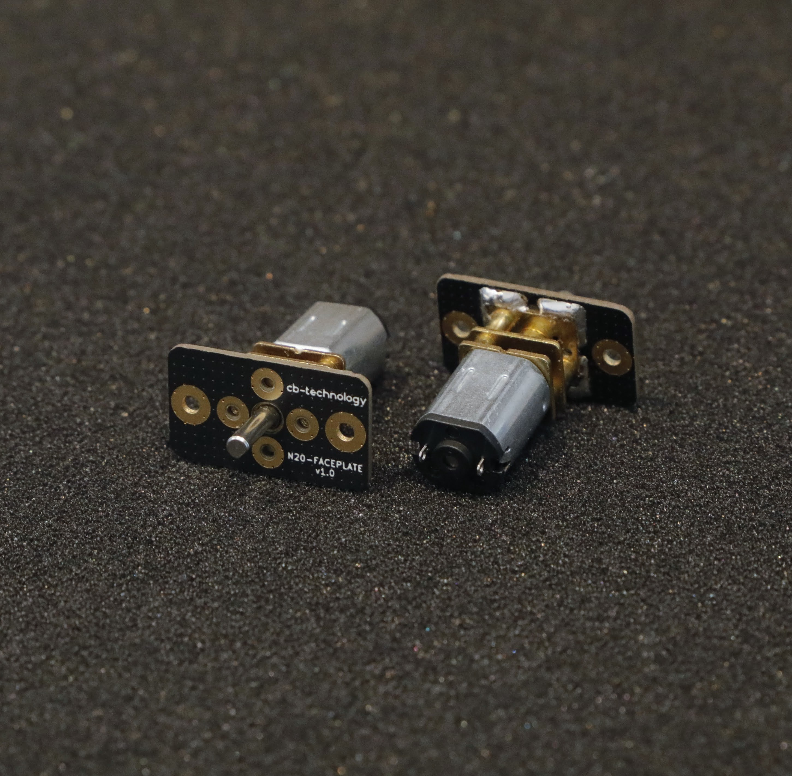
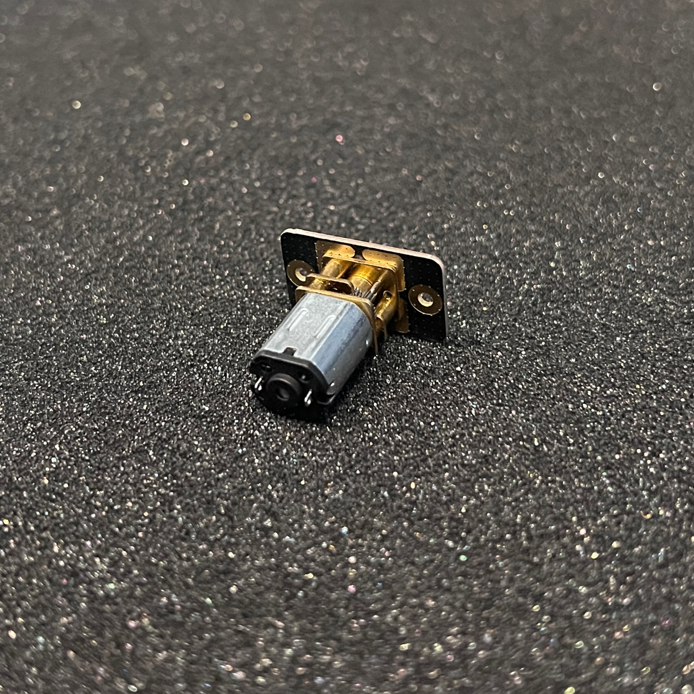
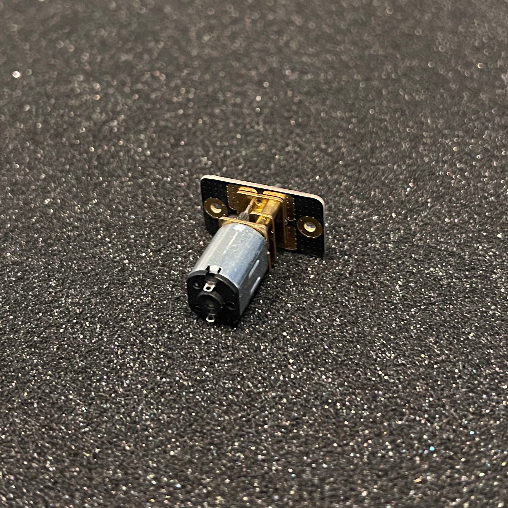
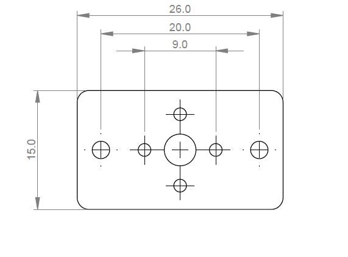
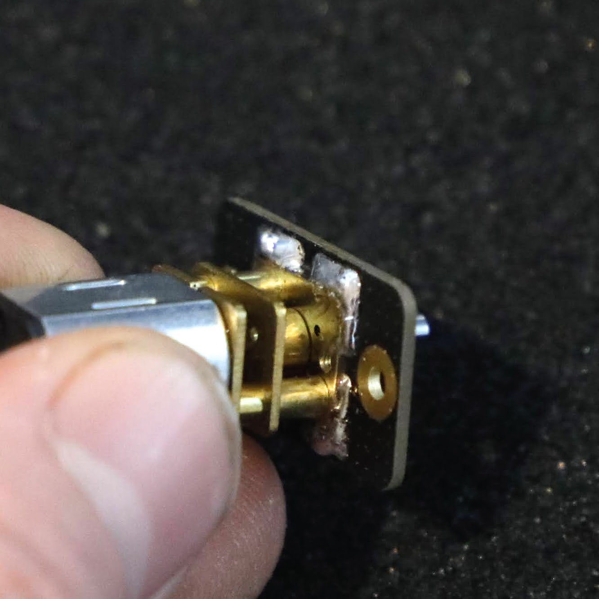
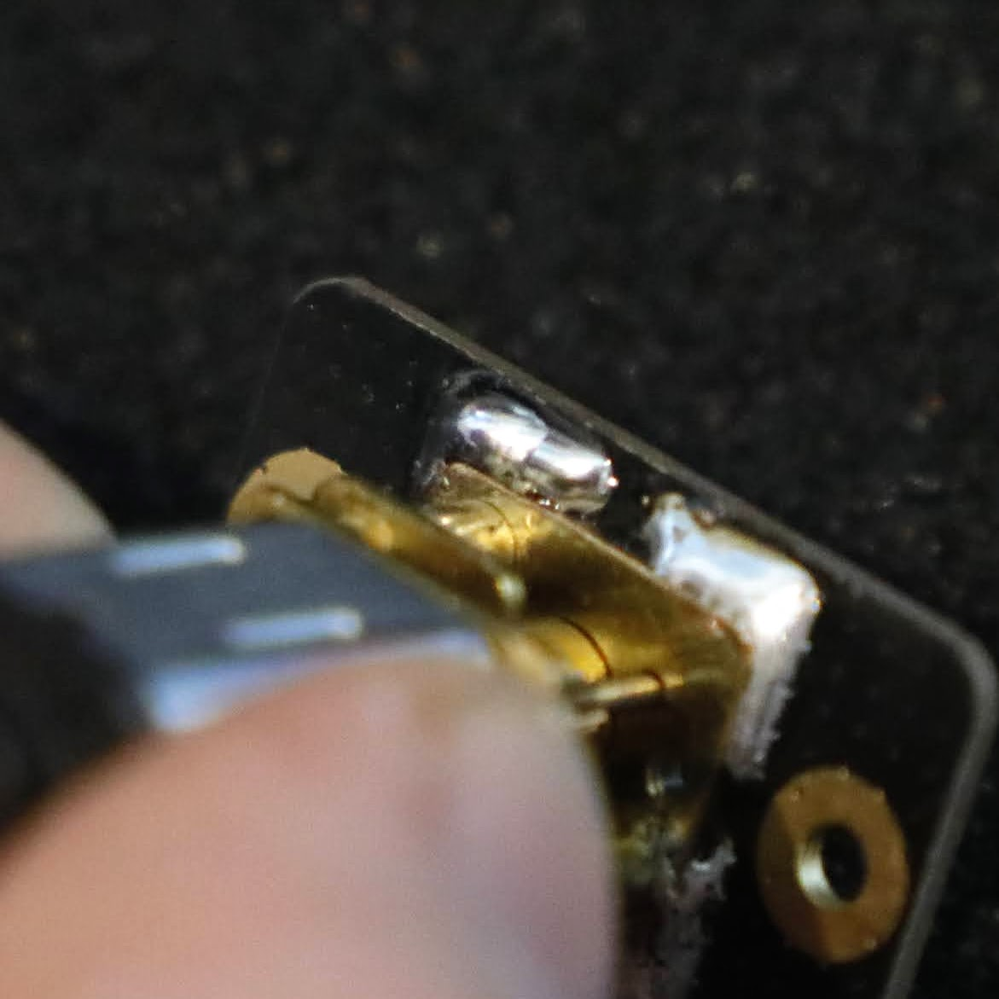

# N20 MOTOR FACEPLATE MOUNT v1.0 (2-pack)

Each N20 FACEPLATE is designed to solder to a single N-series (N10 / N20 / N30) motor then easily and rigidly panel mount that assembly to your desired chassis. This product was orignially designed for insect weight combat robotics but is suitable as a sustitute mount for any application using these motors. 

*The process to solder the motors to the mount is not difficult but it just take some patience.*
  
This is a [New Zealand](https://www.google.co.nz/maps/place/Christchurch+New+Zealand) based product by [cb-technology](https://www.cb-technology.co.nz/), Connor Benton.

## FEATURES
- Easy and rigid way to pannel mount N-series (N10 / N20 / N30) motors.
- Despite being so thin, the faceplate its constructed from fiberglass and so is very rigid. 
- Allows for vertical and horizontal mounting of motors.
- Users can mount the motors to the faceplate using any combination of bolting, soldering, and/or gluing; Soldering is recommended.

## SPECIFICATIONS
- **Dimensions:** 26x15x1 mm
- **Weight:** 1g each
- **Material:** FR4 (Fiberglass)
- **Included in Package:** 2x Faceplates, 2x M2 Cap Screws + Nuts, 2x M1.6 Pan Head Screws.

## MOTOR INSTAL ORIENTATIONS

1. Horizontal

    

2. Vertical

    

## FACEPLATE INSTALL PATTERN

## SOLDERING MOTOR TO FACEPLATE

The most common problem when soldering objects like these together is not allowing them to heat up enough before attempting to solder together: resulting in a dry joint.

1. Mount the motor to the faceplate in the desired orientation.

2. Optional: Use M1.6 machine screws to hold the motor in place while soldering. *Be careful when tightening the screws to not contact any gears: some N-series gearboxes have the gears close behind the faceplate.

3. Place the motor onto a heat resistant surface: ceramic tile, sheet or metal etc.

4. Tin the soldering iron tip and use it to heat up the motor and faceplate. To ensure good heat conduction, ensurse there is enough solder on the tip to touch both the gearbox and faceplate. *This step may take longer than expected.*

5. When the solder starts to wick away from the iron (stops blobbing ontop and is 'sucked' away via capillary action) you can begin soldering the rest of the gearbox down. Caution: the motor and gearbox will be very hot when at this stage so do not touch with bare hands.

    - Good Solder Joint. *Nice smooth fillet between faceplate and gearbox.*

        
    
    - Bad Solder Joint. *Solder sits in more of a ball on the faceplate and has poor connection to the faceplate (almost looks like it has been repelled).*

        

6. To fix a bad solder joint you may need to wait longer for the gearbox to heat up, use a littlebit more solder, or add some flux. Be caseful when adding additional flux and solder to not get any into the moving components of the gearbox.

7. Wait for the faceplate and motor to cool down.
